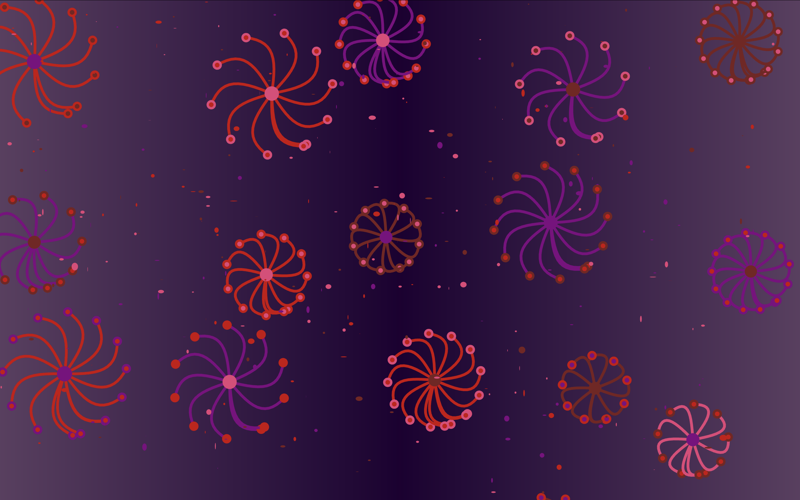

# ylia0918_9103_tut6_MajorProject
## Individual task

Based on the group code, I animated the previous work uilising Perlin noise and randomness, aiming to achieve an interactive abstract scennarios of fireworks. I changed the colour of the background from yellow to a gradient purple to better cater for the fireworks scene, and kept the calour palette for other elements.

### 1. Animation
- The background dots in the dot class are given position, size and colour randomly. By introducing slight random variations (0, 1) in *draw()*, the dots will appear to flash as each frame refreshes, adding tiny sparks to the scene like aftermath of fireworks burst. Below is the code snippet.
```
draw(){
    fill(this.chosenColor);
    noStroke();
    ellipse(this.x, this.y, this.size * random(0, 1), this.size * random(0, 1));
}
```

- Apply Perlin noise to control the dynamics of the flowers and leaves. In *drawFlower()*, the size of the circle in the centre of the flower is slowly scaled up and down according to the output value of growth, which is generated by the mapping of noise *(noiseOffset)*. In *drawLeaves()*, the angle and length of the leaf distribution is controled by *leafNoiseOffset* and *swingAngle*, the angle of the leaf distribution changes within (-5, 10), while *noise(leafNoiseOffset + i * 0.1)* determines the curvature change. Below is the code snippet.
```
let growth = map(noise(noiseOffset), 0, 1, 0.8, 1.2);
let radiusGrowing = leafLength * growth;
ellipse(0, 0, centerSphereSize * growth, centerSphereSize * growth);
```
```
let swingAngle = angle + map(noise(leafNoiseOffset), 0, 1, -5, 10);
rotate(swingAngle);
```

### 2. Interaction
- The vertical move of the mouse *(mouseY)* changes the flower size, varying it between 0.8 and 1.5 times based on their original size. The horizontal move *(mouse X)* changes the number of leaves of each flower, ranging from 1 to 1.2 times the original amount, conducting a visual effect of spinning. Below is the code snippet.
```
let diameter = map(mouseY, 0, height, 0.8, 1.5); 
let leafnum = map(mouseX, 0, width, 1, 1.2);
drawFlower(circles[i].x, circles[i].y, circles[i].leafCount * leafnum, circles[i].r * diameter, circles[i].colors, circles[i].noiseOffset);
```

- Users are uabled to download the generated artwork as an image by pressing "s" key. Below is the code snippet.
```
function keyTyped() {
  if (key === "s") {
    save("NtangeII_Grass_new.jpg");
  }
}
```

### 3. Fixing an issue in the original code
- In the previous base code, the background dots moved off-screen over time without refreshing, resulting in an empty background. I replaced the original dot-related part using *class* and used *redraw()* to ensure that new dots would be drawn when other dots floated above the screen boundaries. Below is the code snippet for *redraw()*.
```
redraw(){
    this.x = random(width); // Random X-coordinate
    this.y = random(height); // Random Y-coordinate
    this.size = random(5, 15); // Set dot size between 5 and 15
    this.chosenColor = randomColor(); // Randomly select color from color pallet
    this.noiseOffset = random(300); // Random noise offset for unique movement
}

if (this.x < 0 || width < this.x || this.y < 0 || height < this.y){
    this.redraw();
}
```

### 4. Acknowledge
- The inspiration for changing the size of flowers and the anount of leaves as the mouse moves comes from the example of the *[map() function](https://p5js.org/examples/calculating-values-map/)* in *https://p5js.org/*.

- The code snippet of allowing users to save generated image as jpg. comes from the video *[Playing with Perlin Noise in p5.js - generative art with lots of options, plus wave convections](https://www.youtube.com/watch?v=CSMcrKouQ3o&list=LL)* on the YouTube channel *Steve's Makerspace*, see *[code example](https://editor.p5js.org/StevesMakerspace/sketches/qTjXhdC8t)*.

- The gradient background skill (lerpColor) comes from the video tutorial *[p5.js Coding Tutorial | Color Gradient Animation (lerpColor Function)](https://www.youtube.com/watch?v=lPgscmgxcH0)* on the Youtube channel *Patt Vira*.

###### An example of the final result:

